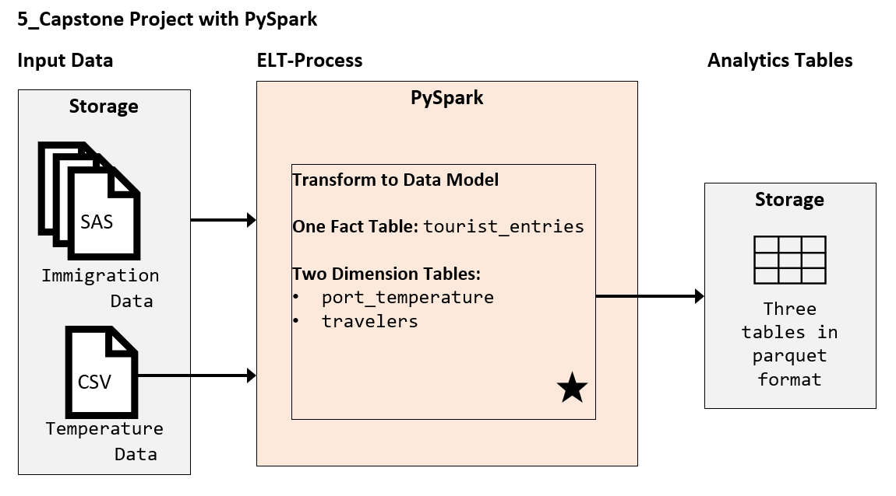
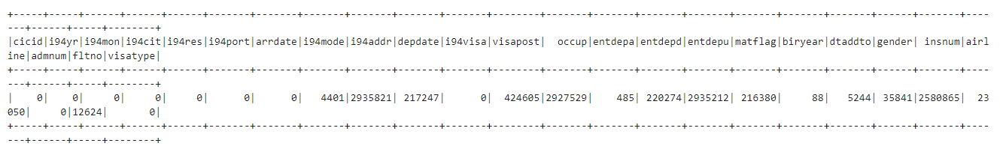
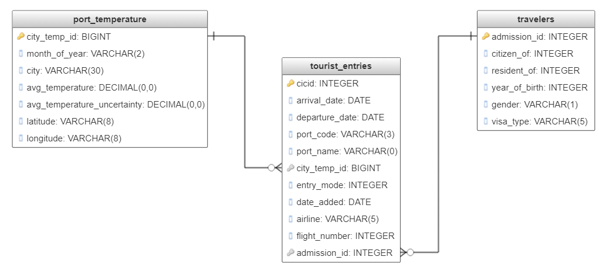

# How to approach this project for review
- The Jupyter Notebook contains both the python scripts elements and the project documentation and write-up mixed together
- It also contains `.show()`, `.count()` and other display commands, which necessary for development, make the etl-pipeline slower

So, in addition to the full Jupyter Notebook, we have provided, two documents which both are derived from the notebook:
    1. the standalone etl-pipeline in `Capstone-Project-ETL.py` - minus the non-relevant code cells (marked with `#nfp`)
    2. the standalone project write-up in this document below (`README.md`) - minus some comments

**An important note when reviewing the Jupyter notebook: in some cells you find the comment `#nfp` or something similar. This means that this specific cell is only intendes for showing and control purposes when developing, but not for the final production pipeline/script. In other words, if you skip running this cells, the end result of the script should still be the same**

---
# Data Preparation for the Analysis of Tourism Visits in the United States from Mexico and the Northern Triangle (El Salvador, Guatemala, Honduras)
### Data Engineering Capstone Project
This project and this document are part of the final project for the Data Engineering Nanodegree from Udacity (a.k.a. "The Capstone Project"). The goal is to use the skills and methods learned within the program, to run a Data Engineering project from scratch. We will use the project provided by Udacity, in which a large dataset of arrivals into the United States from all over the world, forms the basis of the data.

#### Project Summary
In this project, we start with a clear **data-driven goal**, from which we derive a **series of steps** to reach that goal using **large quantities of data**. This intends to replicate the typical process a data engineer goes through on a regular basis.

The goal:
- Structure and prepare immigration and temperature data to allow the analysis of tourism activities to the U.S. from Mexico and the Northern Triangle (El Salvador, Guatemala, Mexico).
    - One important constraint or requieremoent: we shall provide a fine granularity of data (low aggregation levels) to maximize the flexibility of the analysis to be done on our end data (a.k.a. analytics tables), e.g. pattern recognition, dashboards, etc.

The data:
1. Immigration Data from the United States I-94 Arrivals Programm
2.  Global Surface Temperature Data recorded since the 18th century 

The series of steps for this project:
* Step 1: Scope the Project and Gather Data
    - Explain the project scope in more detail, as well as the data sources we are using
    - State how the end solution should look like, the approach and the tools we are using
* Step 2: Explore and Assess the Data
    - Explore the datasets and identify data issues
    - If necessary, modify, pre-process and clean the data
    - Run checks to understand the data and test some assumptions
* Step 3: Define the Data Model
    - Present the conceptual data model
    - List the steps from the data pipeline to build the data model
* Step 4: Run ELT to Model the Data & Data Quality Checks
    - Run the pipeline
    - Run Data Quality checks
    - Provide a Data Dictionary
* Step 5: Document the Project
    - Explain our choice of tools and technologies
    - Offer some critical points of our own
    - Talk about what possibilites arise in case of new scenarios or changed requirements for our analytics tables

### Step 1: Scope the Project and Gather Data

#### Scope 
##### Explain what you plan to do in the project in more detail:
- Latin American countries have seen large migrations of their populations throughout the last decades ([National Library of Medicine](https://www.ncbi.nlm.nih.gov/pmc/articles/PMC4638184/)). The immigration stemming from Mexico and the so called Northern Triangle of Central America (El Salvador, Honduras, Guatemala) are specially relevant for the US and these countries. As of 2020 there are around 36 Mio. mexicans living in the United States, 2.2 Mio. Salvadorans, 1.5 Mio. Guatemalans and around 1 Mio. Hondurans ([US Census Bureau - 2020](https://data.census.gov/cedsci/table?q=B03001%3A%20HISPANIC%20OR%20LATINO%20ORIGIN%20BY%20SPECIFIC%20ORIGIN&g=&lastDisplayedRow=30&table=B03001&tid=ACSDT1Y2019.B03001&hidePreview=true)). Taking into account each countries home population, respectively: 130 Mio., 6.5 Mio., 16.9 Mio. and 9.9 Mio. ([World Bank](https://databank.worldbank.org/data/download/POP.pdf)) it becomes clear how economically relevant the population living in the US can be for these four countries. Although there are many economic factors at play involved with migration (in both receiving and giving countries), we will focus our scope in tourism, specifically the opportunity cost of tourism. Many latin americans travel to the US to visit family and friends, thus doing tourism abroad and not at home.
- In this project we will focus on the **tourist** travelers of these **four latin american countries** to the United States in the **year 2016.** We will prepare data from different sources into analytics tables, such that interested parties can create analysis and potentially dashboards off of this data.

##### What is your end solution look like? What tools did you use?
- Since we are working with large amounts of data, we are going to use to use a 'Data Lake' approach to 1. read the raw data, 2. process and transform it and 3. write it to data storage. From there, analytics can easily be run on top of our result (analytics) tables.
- Technically, we are going to use PySpark, which leverages the Spark technology to do all three steps described above - even and specially for large amounts of data.
- The proposed solution needs storage for the Input Data and for the Output Data. We do not give a fix technology, since any storage service that can cope with the amount of data handled here (in terms of storage and read/write capabilities), and we the formats (csv, sas, parquet), will do. An example storage service would be AWS S3.
- On a high level, or ELT-approach can be represented as follows:
    - - 

#### Describe and Gather Data 
##### Describe the data sets you're using. What data do you use? What type of information is included? 
- I94 Immigration Data:
    - Raw data format: SAS-files
    - This dataset contains arrivals data to the United States from the I-94 Arrivals Program. It provides factual data about the  type, length and mode of the arrival/visit as well as some few non-personal information from non US-visitors. Specifically, a row in the dataset represents an arrival from one visitor with stays of 1-night or more and visiting for different visa types (tourism, business or student). The data is for the calendar year of 2016, which in its complete state contains a couple of million rows, since the data is not aggregated (to our knowledge).
    - Since we are, among other countries, interested in visits from Mexico it is worth noticing that regular Mexican visitors to the U.S. "within the 25-mile (40 kilometer) frontier zone are not included" ([Reference](https://www.trade.gov/i-94-arrivals-program)).
    - For more information, you can check the data dictionary in the file 'I94_SAS_Labels_Descriptions.SAS' or check the source:
        - The dataset was provided by the U.S. National Travel and Tourism Office > [link to source](https://travel.trade.gov/research/reports/i94/historical/2016.html)
    - Relevant data for this project:
        - To reduce the data load on Spark processin, we filter directly after import for visits where citizens are from Mexico, and the so called 'North Triangle' (El Salvador, Guatemala, Honduras). We do not filter for residence, since for our purpose the country of residence is not relevant. To achieve the filtering for the values `582.0 (MEX), 528.0 (SAL), 576.0 (GUA), 577.0 (HON)` using the column `i94cit`.
        - A note on importing: we noted that the data for June contained six more columns (34 columns) then all the other files (28 columns). So we delete the superfluous columns before appending the data from all months into a single dataframe.
    
- Temperature Data
    - Raw data format: CSV
    - This data contains global information about the earth surface temperature data. It can be sliced and viewed in different ways, e.g. by  country, state, major cities or cities in general. For some places, the measurement date as back as 1750 all the way until september 2013. The original dataset is massive with a combined 1.6 billion temperature records. However, the data we use for this analysis is already aggregated by city.
    - The data contains two temperature-relevant columns: the first is the average temperature and the second is the uncertainty of the average temperature.
    - Besides that it contains latitude and longitude information 
    - A note on the average temperature: it was first during the cleaning of the data that it became apparent, that the data was a monthly average and not a daily average for the cities, which was corroborated by the source (see second link):
        - Source: Berkeley Earth through Kaggle > [link1 to source](https://www.kaggle.com/berkeleyearth/climate-change-earth-surface-temperature-data), [link2 to source](http://berkeleyearth.org/data/)

- Port Codes
    - This is not a new dataset per se, but a subset of the data dictionary from the immigration data. As we will see later, to fulfill our data model, we need to be able to match the temperature data with the immigration data. We do this by matching with the dates (on a monthly basis) and with the cities.
    - However, the immigration data contains only a column called `i94port`, with a three-letter code. The human-readable version of the port/city name can be found within the file 'I94_SAS_Labels_Descriptions.SAS', for the `i94port` field. We have extracted this information and prepared it in a tabular way, for us to use as a conversion table and make the matching between temperature and immigration data easier.

### Step 2: Explore and Assess the Data
#### Explore the Data 
We will explore data quality issues column-wise systematically, according to these aspects:
- Usefulness for the proposed task (columns, rows)
- Data type (categorical, int, float, text, id, string, ...)
- Missing values
- Duplicate data
- (Optional) for numerical variables:
    - Noisiness and type of noise (outliers, rounding errors, ...)

#### 2.1 Explore and clean Immigration Data
Document steps necessary to clean the data

- There are some columns which we won't need for the scope of this project, so we will just drop them from the dataframe:
    - 'count' adds no further value, since all entries are 1
    - 'dtadfile' which is described as 'Date added to I-94 Files' is also not relevant for our scope
    - 'i94bir' this information is redundant, since also contained within 'biryear
- Most numeric columns where infered as `double` type, but are for practical purposes, better modelled as `integer` type. We will cast them to integer.
- Now we will convert all three date columns `arrdate`, `depdate` ,`dtaddto` to a proper string date format: 'yyyy-MM-DD'
- Let's now count for missing values in every column. Results written here pre-ante:
    - For all columns: there are no `NA` or `NaN` values
        - to check, you can run `df_cleaning_1.select([count(when(isnan(c), c)).alias(c) for c in df_cleaning_1.columns]).show()`
    - The distribution of `null` values for the columns' dataframes is as follows
        - 
        - With these results, we can safely delete the columns `i94addr, visapost, occup, insnum, matflag`, since the percentage of missing values is too large and/or are not that relevant to our project. Additionally, the column `entdepu` has more than 90% missing values and since this column, as well as the related `entdepa` and `entdepd` are not much relevant for the purpose of this project, we will also delete all three.
        - For the remaining columns with missing values, we will leave as is: since the percentage is not too high and none of the columns with a higher percentage of missing values are of numerical type to use a fill strategy
- Since for this project we are only interested in tourist travels and as we saw, the column `i94visa` has no missing values, we can filter out the `Business (=1)` and `Student (=3)` entries in the `i94visa` column, and ultimately drop the column (redundant)
- Furthermore since the information contained in `i94yr` and `i94mon` is already contained within the column `arrdate`, we will also drop this columns
- We will deal with duplicate data further down the line, when we create the analytics tables according to the data model in the next section

#### 2.2 Explore and clean Temperature Data
Document steps necessary to clean the temperature data

- A quick glance at the temperature data and to the description of the data, reveals two things (source: https://www.kaggle.com/datasets/berkeleyearth/climate-change-earth-surface-temperature-data):
    1. It contains data for many cities outside of the United States
        - here we will filter the rows, so that only those for the US remain
    2. It contains data ranging from the 18th century up until and including 2013
        - here we will use only the last five years available. We will use this as a basis to build an average of the temperature data, since there is no data fot 2016. We use five years instead of just one, to build a more robust average, since tourism is quite dependent on weather conditions
- Both temperature `AverageTemperature`, `AverageTemperatureUncertainty` columns are of type string, even tough they contain numeric information. So we will convert this to numeric type
- Now we will check for missing values (`null`) or for not valid values like`NaN`
    - We will see that the results are consistent with the summary statistics of the source: https://www.kaggle.com/datasets/berkeleyearth/climate-change-earth-surface-temperature-data
    - In this case there is just one missing value for the average temperature, which we will remove
- As we can see, there are more than 500 date-city combinations with conflicting data either in the temperature columns or in the latitude / longitude ones
- To fix this, we are going to group by date and city and aggregate the rest columns as follows:
    - AverageTemperature: mean
    - AverageTemperatureUncertainty: mean
    - Latitude: first
    - Longitude: first
- Finally, we deal with some aspects of the numeric columns (`avg_temperature` and `avg_temperature_uncertainty`:
    1. rounding: We thought about rounding both temperature columns, but since we are going to aggregate this data later, we are going to skip the rounding here
    2. check if max and min of `avg_temperature` are within the max (39.7) and min (-42.7) values, as given in: https://www.kaggle.com/datasets/berkeleyearth/climate-change-earth-surface-temperature-data
    3. check the max `avg_temperature_uncertainty` value and delete any rows, if any, with a uncertainty higher than 5.
- A final note on what we learned during the cleaning process: the 'count' for the cleaned table is around 15000 rows. If you count the number of unique cities in the set for example with `df_temp_4.select(col('City')).distinct()` it comes to 248. Here it becomes clear, that the temperature average is not daily but monthly for every city. A quick look at the primary source of the data confirms this thought: http://berkeleyearth.org/data/

### Step 3: Define the Data Model
#### 3.1 Conceptual Data Model
Map out the conceptual data model and explain why you chose that 

- Since the purpose of this data project is to prepare granular analytics tables with tourist arrivals and departures to and from the cities in the United States and their relation to the temperature, the two first obvious choices for tables are:
    - Dimension table 1: `port_temperature` > containing the temperature data of the ports, where tourists arrive to the US
    - Fact table: `tourist_entries` > containing the admissions to the US for the year 2016
    - We decided on a third table `travelers` as well, to separate the facts (admissions to the us) from the information related to the personas entering the US. In this way, further information about the travelers could be easily added in the future to this dimensional table, instead of putting even more information in the already large fact table. This could be done, e.g. using the attribute of `admission_id`.

- Note: in the following data model, the data types are just for guidance, but do not match the exact type used here in PySpark. The data model can be summarized as follows:
    - 
    
- Note: We also  thought to include a separete time table but without a millisecond-timestamp and the fact table being based on days, it does not make much sense. Furthermore, the goal of the analytics tables is to provide a base for aggregations and further high-levels analysis, for which a time table would be overdone.

- As already mentioned, the purpose of this data model is to prepare analytics tables with clean and robust information on which analysis and aggregations on travelers data from Mexico and the Northern Triangle can be performed. With this background and for four concrete reasons, we chose a relational data model to model our data:
    1. The relational model is by nature intuitive and easy to understand and thus facilitates the usage of the data for analytics purposes; specially for people that do not fully want to or need to understand the raw data
    2. We don't know a-priori the specific queries that are going to be used on the dataset for it to be justified to use an NoSQL / Non-Relational approach
    3. Even though the fact table is quite large, PySpark and the possibilities of distributed systems can cope with these and even larger amounts of data so in the case that someones wants to add more temperature, travelers or arrivals data
    4. The relational data model allows for clear and strong data-types for each columns, which helps with data integrity. And even tough, PySpark does not strictly enforce constrains such as primary key, it has a strong columnar data-integrity and strong built-in functions to build help build such constrains on top

#### 3.2 Mapping Out Data Pipelines
List the steps necessary to pipeline the data into the chosen data model

##### 3.2.1 Creating the table `port_temperature`
- The basis for this analytics table is the cleaned temperature data from 2009 to 2013 for US cities To create the new table:

1. we will average the temperature data over the five years for each city and each month of the year. To access this information we will create a column `month_of_year` and drop the original date column, since the year information would be misleading.
2. for `latitude` and `longitude` we will aggregate by `first`.
3. the primary key for this table will be a new column called `port_id`, which we will create by matching the `City` name with the dictionary data for the column `i94port` from the immigration data.
4. as the final step of this pipeline, we will remove any duplicates

##### 3.2.2 Creating the table `tourist_entries`
- The basis for the `tourist_entries`table will be the cleaned and prepared immigration data. We decided **not** to aggregate the facts over cities, dates or any other attribute - since this provides the maximal granularity over the data and thus the most aggregation-flexibility for future analytics use cases. So the steps included for creating this table are:
1. selecting the relevant columns and renaming them, as to match the data model (see diagram above)
2. removing any duplicates (during the cleaning process we had already established that the `cicid` was unique across all rows)

##### 3.2.3 Creating the table `travelers`
- The `travelers` table we'll create from the clean immigration data. The steps are similar as for the `tourist_entries` table. The connection between this table and the fact table will be the `admission_id`

### Step 4: Run Pipelines to Model the Data & Data Quality Checks
#### 4.1 Create the data model
Build the data pipelines to create the data model.

#### 4.2 Data Quality Checks
Explain the data quality checks you'll perform to ensure the pipeline ran as expected.

- We will perform three data quality checks, two integrity constraints on the unique keys and one count check over all tables:
    1. Quality check 1 (QC1): will consist of checking for missing values in the primary key of each table. For this we, select just the column containig the primary key, filter for existing null-values and then take a count. If the value is any other than zero, we print a warning. Since PySpark nor Parquet (or chosen output data-format) do not enforce this type of integrity constraints - as opposed to a Postgres database - it makes sense to check them after running the data pipelines. The same applies for the next check.
    2. Quality check 2 (QC2): will check if the primary key column of each of the three tables contains unique values. To do this, we will compare the count of the full table against the distinct values of the primary key column. If they do not match, we print a warning.
    3. Quality check 3 (QC3): in this count check, we make sure that non of the tables are empty after the data pipelines have ran. If this is the case, we also print a warning.

#### 4.3 Data dictionary 
Create a data dictionary for your data model. For each field, provide a brief description of what the data is and where it came from. You can include the data dictionary in the notebook or in a separate file.

- A data dictionary for our data model has been provided in a tabular way in the file 'Data-Dictionary-Capstone.xlsx'

#### Step 5: Complete Project Write Up / Document the Project
* Clearly state the rationale for the choice of tools and technologies for the project.
    - High Data Volume: In this project we deal with relatively large quantities of data. The whole immigration data contains almost three million rows and the temperature data more than eight million. The immigration data is only for 2016, but more recent data would probably be even larger ([Source](https://www.trade.gov/i-94-arrivals-program)). Spark was build to handle large quantities of data, and if a local Spark installation will not suffice, cloud distributed systems can be used to scale data processing.
    - Non-transactionality: The type of data and goal of this project are not transactional in the sense, that there is no new data coming day-to-day, in which case a data warehouse approach might also be adequate. In this project, we are dealing with historic data, which we can clean and pre-process once and store as a 'Data Lake' to be used when needed
    - Different data-types: for the first version of this project, we are dealing with only two different input data types: CSV and SAS. However, if the analysis of the tourism arrivals in the U.S. should be extended to include other information, this might come in the way of semi-structured or unstructured data. In this case, PySpark and common storage services the approach are more than able to deal with multiple data-types.
    - Flexibility of Data Model: we proposed a conceptual data model, which we thought would be easy to understand and would serve for the goal of this project. However, the specific requirements could change or evolve, specially requirements for facts, dimension tables or for the aggregation level. If the data model ought to be changed or new tables to be added, PySpark provides a more flexibel and intuitive approach (Schema-on-Read), than to create a database everytime, create the tables and write the correct queries to insert the data.
    - Certainly also an argument to have in mind: the cost of storage is usually significantly lower, in comparison to the higher cost of staging and processing large amounts of data on a cloud Data Warehouse service (e.g. Redshift).
    

- Propose how often the data should be updated and why.
    - As mentioned above, the nature of this project is not transactional, but more to prepare historic - rather non-changing - data for analytics purposes. If the 'customer' is satisfied with the time range from the datasets used here (immigration data & travelers: year 2016, temperature data: average from 2009 - 2013), then the data does not have to be updated until the requirement changes.
    - If the requierement changes, and immigration data from year 2020 or if more accurate and recent temperature becomes available, the ETL pipeline ought to be adjusted and run successfully. But if the requirements are still for historic and analytical purposes, then there would also be no need to update the data - until the requirements change.
    - This applies for all three analytical tables (`tourist_entries`, `travelers`, `port_temperature`

* Challenges / Critical observations / Ideas for further improvement:
    - A port of arrival for a traveler is not always the end destination. So assuming the port of arrival to be the tourist destination is misleading. The information of the final destination in the initial column `i94addr` of the immigration data was missing for the majority of the data. However, this additional information could be of great use for the four countries (Mexico + the Northern Triangle) to analyze where their residents and citizens are going
    - Temperature Data was from the years 2009 until 2013. This is another improvement possibility, to provide more current temperature data

* Write a description of how you would approach the problem differently under the following scenarios:
 * The data was increased by 100x.
     - As mentioned above, Spark was build to handle huge quantities of data. A 100x increase in data would certainly be a challenge to a local Spark installation in one computer. However, this is where Spark really shines, that is, when it is used in distributed systems to split the load of data processing. This could be done for example in a scalable cluster on the cloud like AWS EMR
 * The data populates a dashboard that must be updated on a daily basis by 7am every day.
     - This is one classical use case for using a 'workflow manager', where one can precisely schedule data engineering pipelines, tasks, run quality checks on them and monitor their result. Common tools are Apache Airflow, which works well with python, or Luigi which works well with Spark.
 * The database needed to be accessed by 100+ people.
     - Since our approach was a 'Data Lake' one, where the final data is saved into parquet files into storage - we would need a cloud storage service that can:
         - be accesed from people in different places
         - manage multiple concurrent connections
         - give read access rights to at least 100+ people
     - AWS S3 is an example of such a storage service, that with proper configuration, could fulfill these requirements
---

# References
## References for step 1: Scope the Project and Gather Data
- On appending data frames: https://spark.apache.org/docs/latest/api/python//reference/pyspark.pandas/api/pyspark.pandas.DataFrame.append.html
- On properly converting `arrdate` and `depdate` to a date format: https://knowledge.udacity.com/questions/66798, https://knowledge.udacity.com/questions/51157
- Convert string column to date format: https://sparkbyexamples.com/pyspark/pyspark-to_date-convert-string-to-date-format/
